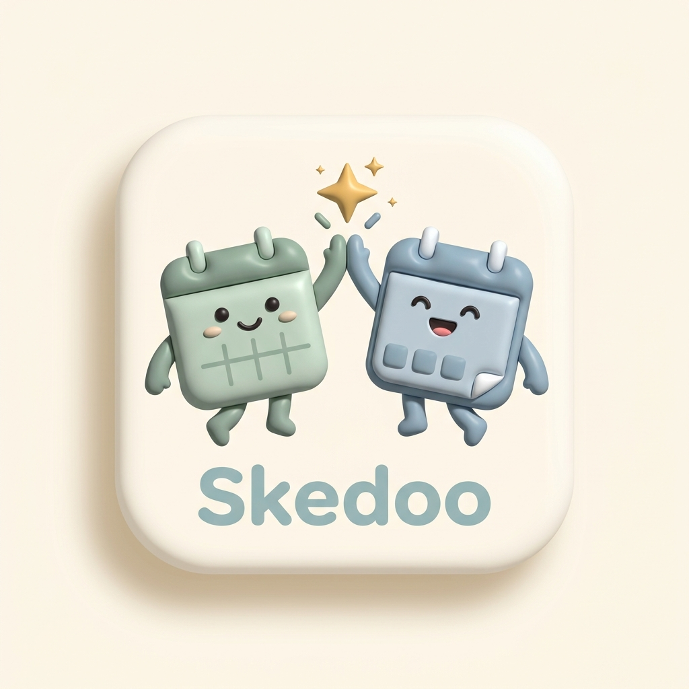

# 🤝 Skedoo - Pengatur Jadwal 2 Sahabat (Duo Bestie Calendar)

Aplikasi web modern pengatur jadwal 2 orang sahabat (*study & hangout buddy*) yang dirancang khusus dengan estetika **Soft Neumorphism & Modern Claymorphism**, sistem input bebas hambatan bertenaga **Google Gemini AI**, dan fitur **Match Finder Waktu Luang**.



---

## ✨ Fitur Utama

1. **🎨 Desain Sistem & Estetika Lembut**:
   - Palet warna pastel alami ramah mata (*Sage Green*, *Dusty Blue*, *Warm Beige / Terracotta*, *Rosewood*, *Pastel Gold*).
   - Efek kartu melengkung (*rounded 20px*), elevasi halus (*soft drop shadow*), dan *micro-animations*.
2. **👥 Dual Perspective Switcher**:
   - **Together (Berdua)**: Menampilkan jadwal gabungan dan waktu senggang bersama.
   - **Dimas (Aku)**: Fokus pada jadwal dan tugas pribadi.
   - **Alin (Bestie)**: Memantau jadwal sahabat tanpa perlu chat *"lagi sibuk gak?"*.
3. **⚡ Solusi "Anti-Malas" (Frictionless Input System)**:
   - **Natural Language One-Liner (Ketik Bebas)**: Cukup ketik santai (*"Besok ada kuis kalkulus jam 10 pagi, sore jam 4 rapat hmj di gedung c"*), AI langsung mengekstrak jam, tanggal, kategori, dan lokasi.
   - **Google Gemini 2.0 Flash Integration**: Mendukung pemanggilan model live Gemini via Google AI Studio API Key.
   - **OCR / Vision Photo Parser**: Ekstrak jadwal dari foto screenshot KRS atau poster seminar.
   - **1-Tap Quick Templates**: Preset cepat untuk aktivitas rutin (*"Nongkrong & Ngopi Bareng ☕"*, *"Nugas 2 Jam 💻"*, *"Kuliah Rutin 🎓"*, dll).
4. **💖 Match Finder (Waktu Luang Berdua)**:
   - Algoritma pencari celah waktu kosong ketika kedua sahabat sama-sama tidak memiliki agenda.
   - 1-Klik tombol *"+ Jadwalkan Nongkrong / Nugas"* untuk langsung mengunci waktu santai bareng.
5. **💬 Quick Ping & Sapa Sahabat**:
   - Kirim colekan/sapaan instan (*"Semangat nugas!"*, *"Ngopi sore yuk!"*, *"Otw tempat biasa"*) dengan animasi balon melayang.
6. **🎵 Audio & Haptic System**:
   - Sintesis Web Audio API nada lembut lofi (*warm chime arpeggio*).
   - Getaran smartphone dengan pola `navigator.vibrate([200, 100, 200, 100, 400])`.
7. **📅 Integrasi Google Calendar**:
   - Ekspor kalender instan berformat standar `.ics` yang bisa langsung diimpor ke Google Calendar web & HP.
   - Dukungan integrasi OAuth 2.0 Google Calendar API v3.
8. **📱 Progressive Web App (PWA)**:
   - Mendukung instalasi *Add to Home Screen* dengan `manifest.json` dan *offline service worker* `sw.js`.

---

## 🚀 Cara Menjalankan Proyek Secara Lokal

Tidak memerlukan instalasi dependensi atau *build tools* yang rumit. Proyek ini berjalan secara murni menggunakan web standar:

```bash
# Jalankan web server lokal dengan Python:
py -m http.server 8080

# Atau buka index.html langsung di peramban Anda:
start index.html
```

Akses aplikasi melalui peramban di: **`http://localhost:8080/`**

---

## 🛠️ Tech Stack & Arsitektur

- **Frontend**: HTML5, Vanilla CSS3 (Soft Neumorphic & Claymorphic Design System), Vanilla ES6+ JavaScript.
- **AI Engine**: Google Gemini API (`gemini-2.0-flash`) & Built-in Indonesian NLP Parser.
- **Audio & Haptic**: Web Audio API & Vibration API.
- **Database Architecture**: PostgreSQL Supabase (skema `profiles`, `duo_spaces`, `categories`, `schedules`, dan Supabase Realtime).
- **PWA**: Web App Manifest & Service Worker.

---

## 📄 Lisensi
Dilisensikan di bawah lisensi MIT.
